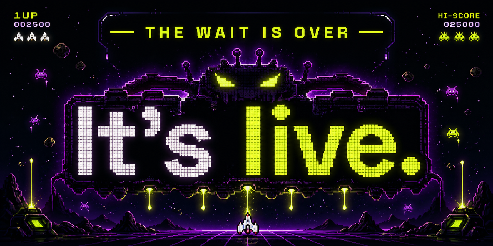

# Node Invaders

A small arcade shooter that runs inside the ComfyUI canvas.

Every kill is a tiny act of rebellion against your monthly bill. Survive the swarm of API nodes and face the ultimate boss in a battle for local inference.

## Game Modes

- **API Invasion**: Only `api/*` nodes spawn.
- **Total Chaos**: Every built-in node is fair game. Maximum carnage.

## Controls

- Mouse: aim
- Left click or Space: fire
- WASD or arrow keys: move
- Right click: use the best ready ultimate
- Esc: close the game panel

## Ultimates

- Rocket: ready every 10 kills
- Laser: ready every 20 kills
- Nova: ready every 40 kills

Nova clears regular enemies, damages the boss heavily, and wipes enemy bullets.

